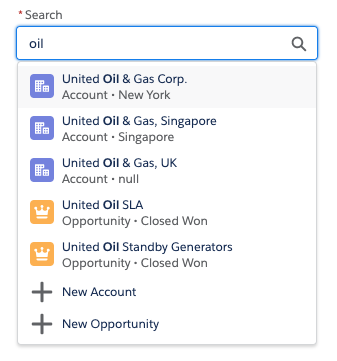

# Salesforce Lookup Component

[](https://github.com/ennoucas/sfdc-ui-lookup-lwc/actions) [](https://codecov.io/gh/ennoucas/sfdc-ui-lookup-lwc)

<p align="center">
    
</p>

- [Salesforce Lookup Component](#salesforce-lookup-component)
  - [About](#about)
  - [Installation](#installation)
  - [Documentation](#documentation)
    - [Getting Started](#getting-started)
    - [Handling selection changes (optional)](#handling-selection-changes-optional)
  - [Reference](#reference)
    - [Attributes](#attributes)
    - [Functions](#functions)
    - [Events](#events)

## About

This is a generic &amp; customizable lookup component built using Salesforce [Lightning Web Components](https://developer.salesforce.com/docs/component-library/documentation/lwc) and [SLDS](https://www.lightningdesignsystem.com/) style.<br/>
It does not rely on third party libraries and you have full control over its datasource.

<b>Features</b>

The lookup component provides the following features:

-   customizable data source that can return mixed sObject types
-   single or multiple selection mode
<p align="center">
    
</p>

-   client-side caching & request throttling
-   great test coverage
-   keyboard navigation
-   search term highlighting
-   ability to create new records
<p align="center">
    
</p>

## Installation

The default installation installs the lookup component and a sample application available under this URL (replace the domain):<br/>
`https://YOUR_DOMAIN.lightning.force.com/c/SampleLookupApp.app`

If you wish to install the project without the sample application, edit `sfdx-project.json` and remove the `src-sample` path.

Install the sample app by running this script:

**MacOS or Linux**

```
./install-dev.sh
```

**Windows**

```
install-dev.bat
```

## Documentation

### Getting Started

Follow these steps in order to use the lookup component:

1. **Write the search endpoint**

    Create an Apex class that implements the interface `ILookupSearchProvider` and the three methods `search`, `getDefaultResults` (used to return a list of recently viewed records (see sample app)) and `getNewRecordOptions`.

    ```java
    public with sharing class SampleLookupProvider implements ILookupSearchProvider {
        public List<LookupSearchResult> search(String searchKey, List<String> selectedIds, String searchFilters) {
            String key = String.escapeSingleQuotes(searchKey);
            List<Account> accounts = [SELECT ID, Name, BillingCountry FROM Account WHERE Name LIKE :key];
            List<LookupSearchResult> results = new List<LookupSearchResult>();
            for (Account acc : accounts) {
                results.add(
                    new LookupSearchResult(acc.Id, 'Account', 'standard:account', acc.Name, acc.BillingCountry)
                );
            }
            return results;
        }

        public List<LookupSearchResult> getDefaultResults(String params) {
            List<Account> accounts = [SELECT ID, Name, BillingCountry FROM Account ORDER BY LastViewedDate LIMIT 1];
            List<LookupSearchResult> results = new List<LookupSearchResult>();
            for (Account acc : accounts) {
                results.add(
                    new LookupSearchResult(acc.Id, 'Account', 'standard:account', acc.Name, acc.BillingCountry)
                );
            }
            return results;
        }

        public List<LookupNewRecordOption> getNewRecordOptions(String params) {
            return new List<LookupNewRecordOption>{ new LookupNewRecordOption('Account', 'New Account', '') };
        }
    }
    ```

1. **Pass the provider class name to the lookup**

    The lookup component exposes a `provider-class` attribute that is the name of the apex class created in previous step.

    ```xml
    <c-lookup provider-class="SampleLookupProvider" label="Search" placeholder="Search Salesforce">
    </c-lookup>
    ```

    The lookup will do the rest

### Handling selection changes (optional)

The lookup component exposes a `selectionchange` event that is fired when the selection of the lookup changes.
The parent component that contains the lookup can handle the `selectionchange` event:

```xml
<c-lookup onsearch={handleSearch} onselectionchange={handleSelectionChange}
    label="Search" placeholder="Search Salesforce">
</c-lookup>
```

The `selectionchange` event handler can then get the current selection form the event detail or by calling the `getSelection()` function:

```js
handleSelectionChange(event) {
    // Get the selected ids from the event (same interface as lightning-input-field)
    const selectedIds = event.detail;
    // Or, get the selection objects with ids, labels, icons...
    const selection = event.target.getSelection();
    // TODO: do something with the lookup selection
}
```

`getSelection()` always return a list of selected items.
That list contains a maximum of one element if the lookup is a single-entry lookup.

## Reference

### Attributes

| Attribute             | Type                                                         | Description                                                                                                                                                                                                                                                                               | Default         |
| --------------------- | ------------------------------------------------------------ | ----------------------------------------------------------------------------------------------------------------------------------------------------------------------------------------------------------------------------------------------------------------------------------------- | --------------- |
| `disabled`            | `Boolean`                                                    | Whether the lookup selection can be changed.                                                                                                                                                                                                                                              | `false`         |
| `errors`              | `[{ "id": String, "message": String }]`                      | List of errors that are displayed under the lookup.                                                                                                                                                                                                                                       | `[]`            |
| `isMultiEntry`        | `Boolean`                                                    | Whether the lookup is single (default) or multi entry.                                                                                                                                                                                                                                    | `false`         |
| `label`               | `String`                                                     | Optional lookup label. Label is hidden if attribute is omitted.                                                                                                                                                                                                                           | `''`            |
| `minSearchTermLength` | `Number`                                                     | Mininimum number of characters required to perform a search.                                                                                                                                                                                                                              | `2`             |
| `placeholder`         | `String`                                                     | Lookup placeholder text.                                                                                                                                                                                                                                                                  | `''`            |
| `required`            | `Boolean`                                                    | Whether the lookup is a required field. Note: Property can be set with `<c-lookup required>`.                                                                                                                                                                                             | `false`         |
| `scrollAfterNItems`   | `Number`                                                     | A null or integer value used to force overflow scroll on the result listbox after N number of items.<br/>Valid values are `null`, `5`, `7`, or `10`.<br/>Use `null` to disable overflow scrolling.                                                                                        | `null`          |
| `selection`           | `[LookupSearchResult]` OR `LookupSearchResult`               | Lookup initial selection if any. Array for multi-entry lookup or an Object for single entry lookup.                                                                                                                                                                                       | `[]`            |
| `variant`             | `String`                                                     | Changes the appearance of the lookup. Accepted variants:<br/>`label-stacked` - places the label above the lookup.<br/>`label-hidden` - hides the label but make it available to assistive technology.<br/>`label-inline` - aligns horizontally the label and lookup.                      | `label-stacked` |

### Functions

| Function                     | Description                                                                                                                                    |
| ---------------------------- | ---------------------------------------------------------------------------------------------------------------------------------------------- |
| `getSelection()`             | Gets the current lookup selection as an array of `LookupSearchResult`. |

### Events

| Event             | Description                                                                                                                                                                                                                                                                           | `event.detail` Type                                                      |
| ----------------- | ------------------------------------------------------------------------------------------------------------------------------------------------------------------------------------------------------------------------------------------------------------------------------------- | ------------------------------------------------------------------------ |
| `selectionchange` | Event fired when the selection of the lookup changes. The event's `detail` property holds the list of selected ids.<br/>You can also use `target.getSelection()` to retrieve the selected lookup objects.                                                                             | `[ String ]`                                                             |
